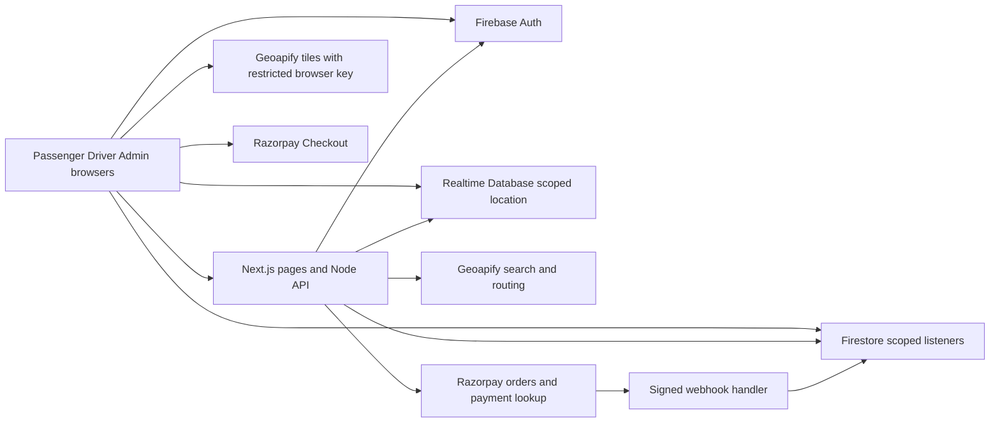

# Cab Booking Technical Requirements

Version 1.0 · 7 October 2026 · Depends on [PRD](01-product-requirements.md) · Status design specification, integrations not yet verified

## Technical objective

Implement the passenger, driver, and admin journeys as a modular Next.js website. Trusted state transitions and payments execute on the server. Firestore is authoritative for durable business state. Realtime Database contains ephemeral location/presence, never balances or assignments. This is an architecture proposal; no cloud resource has been provisioned by creating these documents.

## Stack and reasons

| Layer | Decision | Reason and trade-off |
|---|---|---|
| Language | TypeScript strict mode | Shared contracts and safer lifecycle handling; runtime validation still required |
| Frontend | Current stable supported Next.js App Router + React; pin exact versions at setup | Routing, protected layouts, server APIs in one deploy; Leaflet/Firebase browser SDKs remain client components |
| UI | Tailwind CSS; Radix-based accessible primitives where useful; Lucide icons | Consistent tokens and dialogs; design brief overrides default component styling |
| Forms | React Hook Form + Zod | Shared field validation, explicit errors; server schemas are authoritative |
| Server | Next.js Route Handlers using Node runtime, Firebase Admin SDK | Avoid separate Express hosting and persistent WebSocket requirements; keep domain services outside handlers |
| Durable DB | Planned Cloud Firestore Standard edition, native document model | Familiar Core queries and free-quota compatibility; no SQL joins/foreign-key enforcement |
| Live location | Firebase Realtime Database | Native presence and simple small live records; access mirrors require explicit synchronization |
| Auth | Firebase email/password + Google | One identity provider integrates with rules; no SMS OTP cost dependency |
| Maps | Leaflet, using a compatible stable React integration | Mobile markers and route display; not a navigation/routing service itself |
| Location APIs | Geoapify tiles, autocomplete, reverse geocoding, road routing | No-card free start, one provider adapter; quotas and OSM attribution required |
| Payments | Razorpay Standard Checkout, Test Mode | India-oriented sandbox workflow; live activation and driver transfers separate |
| Receipts | Server-generated PDF with pdf-lib | No file storage bucket required; receipt generated from captured payment record |
| Tests | Vitest, Firebase Emulator Suite, Playwright | Domain, permission, and two-user browser coverage |
| Hosting | Vercel for web and server routes | Single app deploy; no static export; no assumption of a free production service level |

No Firestore instance edition was verified: the read-only CLI discovery failed during documentation preparation. Standard is a planned target, not a claim about an existing project. Before provisioning, verify selected project, edition, region, plan and quotas. Do not silently deploy this schema into a different edition. Proposed colocation is Firestore Mumbai region if available to the selected project and a compatible nearby Vercel execution region; verify platform availability first.

## Architecture



Folders: `src/app` routes/layouts; `src/components` reusable UI; `src/features/{auth,booking,driver,payments,support,admin}`; `src/server/{auth,services,repositories,providers}`; `src/contracts` Zod schemas and DTOs; `src/lib/firebase/client.ts` and server-only `admin.ts`; `tests/{unit,integration,e2e}`; `firebase/{firestore.rules,database.rules.json,firestore.indexes.json}`. Provider adapters make Geoapify/payment implementations replaceable without changing domain IDs.

Server services: AccountService, QuoteService, DispatchService, RideService, PaymentService, ReviewService, SupportService, AdminService. Repositories enforce document 05. Client never imports Admin SDK or service-account secrets. Use `server-only` guards. Database transactions may retry; no notifications, provider calls or other external effects within their callbacks. Firestore provides atomic transactions; this is the basis for assignment and financial writes. [Firestore transactions](https://firebase.google.com/docs/firestore/manage-data/transactions)

## Authentication and sessions

Use Firebase client SDK local persistence for the authenticated browser because Firestore/RTDB listeners require Firebase credentials. Obtain fresh ID tokens for API calls via `Authorization: Bearer`. Validate with Admin SDK including revocation/disabled-account checks for privileged mutations. Do not manually store tokens in application localStorage or URLs.

For server-rendered protected pages, issue an HttpOnly Secure SameSite=Lax Firebase session cookie valid for five days. `POST /api/session` exchanges a recent ID token (auth_time within five minutes) after Origin and CSRF validation. `DELETE /api/session` clears it. Keep client Firebase authentication signed in: this architecture deliberately uses both browser auth and a server cookie, unlike a cookie-only example. Refresh cookie through a fresh-token exchange before expiration. If either identity differs, clear both and require sign-in. Cookies protect pages; API writes use verified bearer identity and current Firestore account state. [Firebase session guidance](https://firebase.google.com/docs/auth/admin/manage-cookies)

Administrator checks read server-controlled role claims plus current user state; driver actions also check approval and active vehicle from Firestore, never only a cached claim. Driver suspension flips access flags before revoking tokens. No admin role selector on registration. Sign-out leaves server ride records intact, clears subscriptions, stops location, sets driver offline if safely possible, clears cookie and client auth. A driver with an active trip sees a warning before sign-out; cancelling that warning preserves the trip UI.

## API contract conventions

Base `/api`. JSON timestamps ISO 8601 UTC; persistent timestamps Firestore Timestamp. Money integer paise; coordinates `[longitude, latitude]` only in GeoJSON, `{lat,lng}` in our DTOs. Strict unknown-field rejection. Body limit 16 KB except webhook limit 256 KB. Responses: `{data, requestId}` or `{error:{code,message,fieldErrors?,retryable},requestId}`. List response `{items,nextCursor}`; signed opaque cursors scoped to user/filter, default limit 20, maximum 50. Error messages never leak credentials/provider internals.

`Idempotency-Key` UUID required for booking, ride mutations, payment-order creation, reviews, support creation/messages and admin mutations. Same actor/operation/key/body returns original committed result. Same key with different body: 409. Recheck authorization on replay. Server stores 24-hour operation records; business uniqueness remains after their cleanup. Updates send `expectedVersion`; stale writes 409 with refreshed state. HTTP: 400 invalid, 401 unauthenticated, 403 forbidden, 404 missing/inaccessible object, 409 conflict, 410 expired, 422 domain validation, 429 throttled, 502 provider failure, 503 unavailable.

## Endpoint inventory

| Method and path | Actor / request | Response and behavior |
|---|---|---|
| GET `/config` | Public | Sanitized service area, Economy, demo rates, feature/environment labels; never keys or secrets |
| POST `/session` | ID token, CSRF token | Cookie set after checks; no role change |
| DELETE `/session` | Origin + CSRF | Cookie cleared; browser must also sign out |
| GET `/me` | Authenticated | Own profile, roles, approval, locks, unresolved payment; absent user document returns needsOnboarding and safe Auth identity fields |
| POST `/me/onboarding` | role intent rider/driver, name, phone | Creates own user and driver draft idempotently; never grants admin/approval |
| PATCH `/me` | Own name/phone/defaultWorkspace | Validates allowlist; workspace must already be a granted capability; email/password through Firebase Auth |
| POST `/me/verification-email` | Email account | Rate-limited Firebase verification action; generic success |
| POST `/drivers/application` | Driver; intent=draft/submit, vehicle fields, expectedVersion | Saves draft or submits/resubmits pending application; approved vehicle edits require fresh review |
| GET `/drivers/me` | Driver | Driver profile, selected vehicle, availability and active ride |
| POST `/drivers/me/availability` | approved driver; online bool | Online requires fresh server-observed presence/location, no active ride; offline never changes ride state |
| POST `/drivers/me/heartbeat` | Driver, latest location/session sequence | Updates matching summary at most once per 60 seconds; validates access; expires stale availability |
| GET `/places/search?q=&lat=&lng=` | Authenticated; 3–120 chars | Up to five coordinate-backed suggestions; 350 ms debounce and cancellation on client |
| GET `/places/reverse?lat=&lng=` | Authenticated | Label for pin; failed lookup may use formatted coordinates with explicit label |
| POST `/quotes` | Rider; pickup/destination Place | Server road route and fixed fare, quoteId, expiry; no client-supplied amount accepted |
| GET `/quotes/:id` | Owning rider | Quote review/reload DTO; assigned driver receives route through own ride DTO, not this endpoint |
| POST `/rides` | Rider; quoteId | Consumes quote, creates ride and rider lock atomically; fans out persisted offers; returns rideId/status |
| GET `/rides/:id` | Own passenger/assigned driver/admin | Authorized ride DTO; normalizes search expiry; repairs access mirror if needed |
| GET `/rides?role=&status=&cursor=` | Participant/admin | Own scoped history; terminal states and pending completed trips included |
| POST `/rides/:id/refresh` | Participant | Normalize expiry, run bounded dispatch/access repair and return canonical state; safe retry |
| GET `/drivers/me/offers` | approved driver | Up to ten own open offers, normalized deadlines; never arbitrary city rides |
| POST `/rides/:id/accept` | Offered driver, expectedVersion from offer DTO | Transaction claims ride, rider/driver locks; conflict if already taken/offline/expired |
| POST `/rides/:id/decline` | Offered driver | Own offer becomes declined; other offers remain open |
| POST `/rides/:id/arrive` | assigned driver | assigned → arrived; explicit confirmation |
| GET `/rides/:id/pin` | Owning passenger | Decrypt four-digit PIN; no driver/admin retrieval; no logs/cache |
| POST `/rides/:id/start` | assigned driver; pin | arrived → in_progress; five incorrect attempts per minute; PIN never in normal ride DTO |
| POST `/rides/:id/complete` | assigned driver | in_progress → completed, payment pending, final fare locked; driver lock clears |
| POST `/rides/:id/cancel` | passenger or assigned driver; reason | searching/assigned/arrived → cancelled; zero fee, locks and access revoked |
| POST `/rides/:id/payment-order` | Owning passenger; no amount | Creates/reuses canonical Razorpay order and returns checkout fields |
| POST `/payments/verify` | Passenger; rideId, orderId, paymentId, signature | Server verifies association/signature and fetches capture; applies captured state or processing |
| GET `/rides/:id/payment-status` | Passenger/assigned driver/admin | Current state; passenger may trigger rate-limited provider reconciliation |
| POST `/webhooks/razorpay` | Raw body + provider signature | Verify signature, deduplicate event, apply monotonic captured state; no browser auth |
| GET `/rides/:id/receipt` | Passenger/assigned driver/admin | PDF attachment only for paid record; no-store; no tax invoice claim |
| POST `/rides/:id/review` | Owning passenger; stars, comment | Completed ride only; one immutable review, aggregate once; payment may be pending |
| GET `/drivers/me/earnings?range=today/last7/all&cursor=` | Driver | Captured simulated ledger plus pending total; date boundary Asia/Kolkata; no payout action |
| GET/POST `/support/tickets` | User; own filter or category/subject/body/rideId? | Own list or persisted new ticket; ride association must belong to caller |
| GET `/support/tickets/:id` | Owner/admin | Ticket and paginated messages |
| POST `/support/tickets/:id/messages` | Owner/admin; body | Append message; admin sets in_progress by default |
| POST `/support/tickets/:id/status` | Owner/admin; target, expectedVersion | Owner reopen resolved; admin open/in_progress/resolved; closed not used |
| GET `/admin/overview` | Admin | Real pending applications/open tickets/rides needing attention; paginated/bounded counts |
| GET `/admin/drivers?status=&plate=&uid=&cursor=` | Admin | Applications, versions and vehicle details; plate/UID exact search only |
| GET `/admin/drivers/:uid` | Admin | Current application/vehicle details and applicationVersion for decision |
| POST `/admin/drivers/:uid/decision` | Admin; approve/reject/suspend, reason | Audit and access flags; active trip blocks suspension with 409 |
| GET `/admin/rides?status=&paymentStatus=&rideId=&cursor=` | Admin | Search by exact ride ID or bounded state/payment-attention list; no unbounded personal search |
| POST `/admin/rides/:id/reconcile` | Admin | Recheck provider/access state; never manually mark paid |
| GET `/admin/support?status=&cursor=` | Admin | Support queue |
| POST `/admin/demo/reset` | Admin in demo env | Reset only explicit demo records after confirmation; block active/captured records; audited |
| GET `/health` | Public | Generic ready/degraded status only; no configuration or credentials |

Health/readiness must fail clearly when required secrets are absent; do not substitute fabricated quotes or payment confirmations. Driver simulation starts through allowlisted admin-seeded demo identities and updates the same location protocol with `source=simulation`; no public simulation endpoint.

## Dispatch and live access

Driver web SDK writes RTDB own presence and location; online listing/ride offers are private. To avoid a bootstrap deadlock, approved offline driver first submits a fresh browser fix to the heartbeat endpoint; server validates it and issues a short driverAccess/session grant, then browser publishes presence/location and requests online availability. Driver remains offline until this succeeds. Server heartbeat creates a coarse Firestore driver geo summary (geohash + point + timestamp) no more often than once a minute, and immediately when going online or accepting. Query geohash bounds, filter actual distance, approval, availability, lock, source/environment and freshness ≤75 seconds. At acceptance revalidate RTDB presence/location age ≤15 seconds. Sort eligible candidates by straight-line distance then UID for stable ordering; cap ten. This is proximity matching, not traffic prediction. Geohash results need distance filtering. [Firebase geoqueries](https://firebase.google.com/docs/firestore/solutions/geoqueries)

Offer materialization is an idempotent second stage after the ride transaction; store dispatchStatus pending/ready/error. Retry the same candidates through refresh rather than creating another ride. Before returning a ride as ready for live tracking, server writes an RTDB access mirror with exact rider/driver IDs, allowed tracking state and expiry. Firestore and RTDB cannot commit atomically: persist sync-needed version and use authorized reads/refresh to retry. Fail closed while mirror is missing. Acceptance itself remains valid; show "Ride accepted. Connecting tracking…". Cancellation revokes mirror; short validity renewal limits stale access when revocation fails. Details in schema.

No permanently running timer or process inside Vercel functions. Search timeout enforced from expiresAt on every authoritative read/mutation. Foreground rider and driver polling/refresh at 10-second interval while searching triggers lazy cleanup. No-driver UI at deadline even if nobody is online; transaction releases locks next authorized access. The matching pool does not expand during a request in V1. Closed browser means expiry is lazily materialized later, not lost.

Before acceptance, recheck current RTDB point within 5 km, not just its cached matching summary. Booking also reads any own driver lock/availability; online or actively driving users must go offline/finish first. Going online reads the user's passenger lock and refuses while unsettled. Exclude rider UID from candidates. Lifecycle `version` changes only for business mutations; location sampling/access lease renewal does not increment it or force perpetual conflicts.

### Representative DTOs

```json
{
  "pickup": {"label": "Selected pickup", "lat": 12.9716, "lng": 77.5946, "source": "pin"},
  "destination": {"label": "Selected destination", "lat": 12.9916, "lng": 77.6146, "source": "pin"}
}
```

The quote response includes `quoteId`, both Place objects, `distanceMeters`, `durationSeconds`, `fare` (FareSnapshot), `routeGeometry`, `expiresAt`, and `serviceAreaId`. A booking request body is only `{quoteId}`; rider identity derives from auth. Trip mutations contain `{expectedVersion}` plus only required `pin` or cancellation reason/note. Payment order response includes `paymentId`, `providerOrderId`, `checkoutKeyId`, `amountPaise`, `currency`, `mode` and `status`; the public checkout key ID is returned intentionally, never the key secret. Safe ride DTO redacts candidateDriverIds and secrets but includes participant snapshots, fare, timestamps, `version`, tracking source and optional assigned-route geometry. Illustrative location labels above are examples, not seeded real pickup history.

## Payment reliability

Create one canonical provider order per completed ride/payment record. Acquire a transactional creation lease, call Razorpay outside the transaction, then attach order mapping. Provider timeout after a possible creation is an ambiguous outcome: mark creation uncertain, reconcile by recorded receipt/provider lookup or admin investigation, and never blindly create a second order. Retry checkout against the existing unpaid order. Only a server-confirmed `captured` payment whose amount, currency, order, mode and ride agree may set paid. Checkout dismissal or browser failure never downgrades a captured state. [Razorpay integration](https://razorpay.com/docs/payments/payment-gateway/web-integration/standard/integration-steps/)

Use raw bytes for webhook HMAC, constant-time comparison, event-ID deduplication and transactionally apply paid/receipt/ledger/lock release together. Out-of-order failed/authorized events cannot overwrite capture. Persist only necessary event metadata, not whole sensitive payloads. Callback and webhook use the same capture service. Provider reconciliation recovers interrupted browser flow. Duplicate capture for a different payment ID enters review_required with a support incident; no second ledger. An existing verified receipt/capturedPaymentId remains valid and its released rider lock stays released; distinguish payment investigation from unpaid debt. No automated refunds in V1. [Webhook validation and ordering](https://razorpay.com/docs/webhooks/validate-test/)

## Security and privacy requirements

Default-deny Firestore/RTDB rules; API owns durable mutations. Browser reads only its profile, own offers, participant rides, own review and notifications as specified in schema. Admin SDK bypasses database rules, so every handler must reauthorize. Never trust UID/role/fare/driverId from request bodies. Validate IDs and all bounded fields. Payment secrets, PIN encryption key and service accounts server-only; restrict Geoapify tile key by approved origins; server search key never public.

Same-origin CSRF protection for cookie exchange/logout; no wildcard credentialed CORS. HTTPS, secure headers, no third-party HTML rendering. CSP permits necessary Firebase/Geoapify/Razorpay domains and is tested with checkout; do not bypass CSP with blanket wildcards. Sanitize content by rendering plain text. Rate-limit auth-related APIs, search, quote, booking, PIN and payment operations using a shared durable limiter, never only per-process memory. Initial limits: search 30/min/user; quote 10/min; booking 3/min; PIN 5/min/ride; payment reconcile 6/min; support writes 5/min. Provider-wide Geoapify budget/throttle must consider all users, not per-user only.

Auth email/password policy: min 10 chars with Firebase configured enforcement, clear password guidance; no passwords stored in Firestore. Require verified email for booking/driver online. Admin role assigned with an audited operator action, no hardcoded email trust. Redact logs; no addresses/GPS/PIN/tokens/payment signature/full provider payload in analytics. Ticket descriptions private. Full route geometry kept no longer than needed; raw continuous GPS history not persisted.

## Deployment and configuration

Development: Firebase Auth/Firestore/RTDB emulators, test-mode provider adapter with labelled fixtures only in automated tests. Preview: separate Firebase test project, real Geoapify restricted preview key, Razorpay test keys, demo flag true and allowlisted simulated identities. Production environment initially remains a controlled test-payment deployment with demo disclosure; live mode is a later release gate. Separate projects prevent demo cleanup from affecting real accounts.

Variables: `NEXT_PUBLIC_FIREBASE_API_KEY`, `NEXT_PUBLIC_FIREBASE_AUTH_DOMAIN`, `NEXT_PUBLIC_FIREBASE_PROJECT_ID`, `NEXT_PUBLIC_FIREBASE_DATABASE_URL`, `NEXT_PUBLIC_FIREBASE_APP_ID`, `NEXT_PUBLIC_GEOAPIFY_TILE_KEY` are browser configuration; `FIREBASE_ADMIN_PROJECT_ID`, `FIREBASE_ADMIN_CLIENT_EMAIL`, `FIREBASE_ADMIN_PRIVATE_KEY`, `GEOAPIFY_SERVER_KEY`, `RAZORPAY_KEY_ID`, `RAZORPAY_KEY_SECRET`, `RAZORPAY_WEBHOOK_SECRET`, `TRIP_PIN_ENCRYPTION_KEY`, `TRIP_PIN_HMAC_KEY`, `CURSOR_SIGNING_KEY`, `APP_ORIGIN`, `APP_ENV`, `PAYMENT_MODE=test`, `DEMO_MODE`, `DEMO_DRIVER_UIDS` server-only. Use hosting secret storage; never commit real values. Key rotation must preserve verification of retried old webhook events during overlap.

Deploy rules/indexes before app changes that use them; authorize exact sign-in domains; install signed Razorpay webhook at stable HTTPS route; verify health and full two-user trip on that deployment. Render is optional and was previously reported as requiring reauthentication; do not make it a prerequisite. Rollback application deploy when contracts permit; do not roll back financial records or loosen rules. Version schema and support additive migrations.

Firebase Spark avoids a payment-method dependency for supported services, but quotas apply. Functions deployment requires Blaze. Cloud Storage billing requirements make it unsuitable for our no-billing upload plan; V1 uses initials and generated receipts instead. Recheck policies before provisioning. [Firebase pricing](https://firebase.google.com/pricing), [Functions](https://firebase.google.com/docs/functions/get-started), [Storage billing](https://firebase.google.com/docs/storage/faqs-storage-changes-announced-sept-2024)

Geoapify currently advertises a no-card free plan of 3,000 credits/day and 5 requests/second. Tiles, routing and search share credit accounting; avoid claiming a fixed number of rides. Keep Geoapify and OpenStreetMap attribution visible. Never use public Nominatim for autocomplete or public routing demo servers as a production dependency. [Geoapify plan](https://www.geoapify.com/pricing/), [OSM policy](https://operations.osmfoundation.org/policies/nominatim/)

## Nonfunctional targets and future review

Controlled pilot: up to ten simultaneously online drivers and approximately twenty connected browser sessions, subject to actual RTDB plan limits; verify real quotas and measurements before increasing. GPS writes at most every five seconds per active foreground driver, reducing idle cadence to 15 seconds; driver summary once per minute. Subscribe only to own active ride, own offers and selected history pages. Stop subscriptions on navigation/unmount. Avoid unbounded listeners and whole database scans. Reconnect state derives from persisted records.

Application error monitoring uses request IDs, provider latency, mutation conflicts, capture reconciliation failures, access-sync backlog and quota usage. Admin queue is an operational fallback, not proof of autonomous cleanup. Public scale would require durable background reconciliation, shared fast presence/matching infrastructure, paid capacity, operational safety and real payout design. No deployment or security tests have run merely because this document exists.

## Implementation clarification: route geometry storage

Firestore Standard rejects nested arrays, including raw GeoJSON coordinate pairs. Quotes persist the validated geometry as routeGeometryJson (a bounded JSON string, exempt from indexing); authorized API responses decode it into the specified routeGeometry GeoJSON DTO. No public API contract changes. Matching locations use finite lat/lng fields plus geohash instead of a native GeoPoint, so DTO serialization remains explicit.
