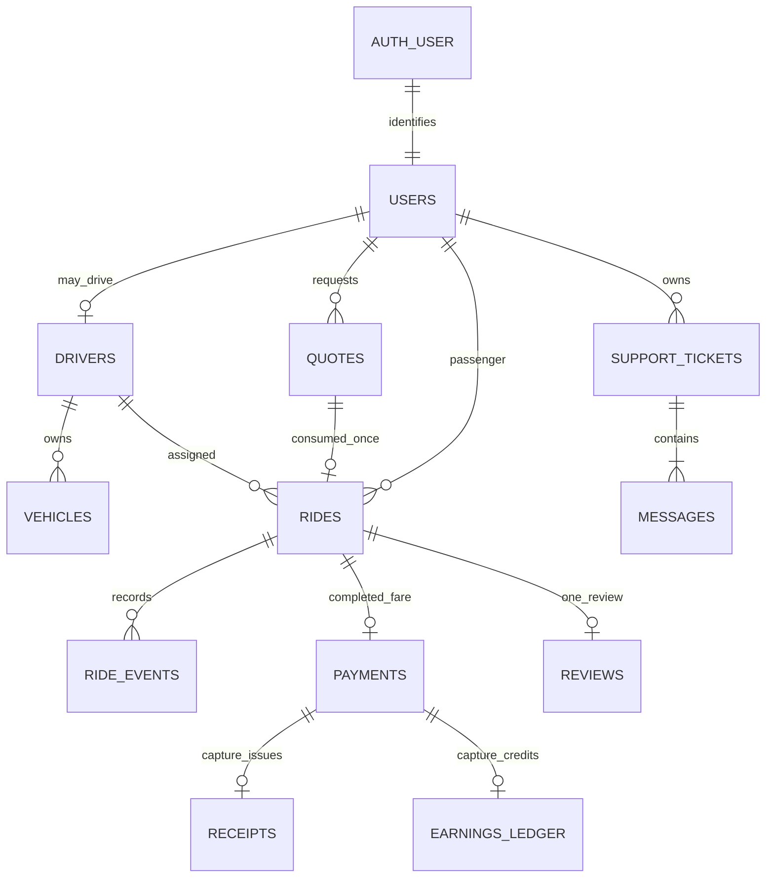

# Cab Booking Backend Schema and Data Ownership

Version 1.0 · 7 October 2026 · Planned Firestore Standard + Realtime Database · Not a deployed schema

## Model conventions

Firebase uses collections/documents rather than SQL tables/columns. Document IDs are primary keys; UID/string references are logical foreign keys verified by server services, not database-enforced constraints. This document supplies the equivalent tables, columns, types, relationships, indexes and permissions. No SQL database is required. Auth identities live in Firebase Authentication, not a password table. Existing project/edition must be verified before provisioning; this is the planned Standard document model.

Notation: `!` required non-null, `?` omitted when absent, `T|null` explicitly nullable. All unspecified field types follow the dictionary below. All durable writes through server APIs, including Admin SDK operations, use strict Zod validation and server authorization. Firestore rules deny browser create/update/delete. No arbitrary fields accepted.

Common fields on mutable business documents: `schemaVersion:int! = 1`, `version:int! ≥1`, `createdAt:Timestamp!`, `updatedAt:Timestamp!`. Immutable event/ledger/map documents require schemaVersion/createdAt but no mutable version unless listed. All timestamps server-assigned. IDs are opaque UUID/Firestore random ID ≤128 chars, except Firebase UID/provider IDs explicitly bounded to 128. UID/ownership/createdAt immutable; past snapshots immutable. Money nonnegative int paise ≤10,000,000; currency enum INR; no floating rupees. Latitude float −90…90; longitude −180…180; GeoPoint is Firestore native type.

String defaults: enum must match enumerated value; display names 2–80; labels 1–200; body/comment limits specified; phone regex `^\+91[6-9][0-9]{9}$`; short notes 0–300; reason 5–500; public error code ≤64; provider IDs ≤128; request IDs/idempotency keys UUID. Maps accept only listed keys; arrays have explicit maxima. Null is not interchangeable with missing required fields. Passwords, provider secrets, private keys, ID/refresh tokens, card/UPI credentials and raw payment payloads must never be stored in these collections.

### Embedded value types

| Type | Fields |
|---|---|
| Place | `label:string!≤200`, `lat:number!`, `lng:number!`, `providerPlaceId:string?≤256`, `source:search|pin|gps|simulation!`; no personal address notes |
| FareSnapshot | `basePaise:int!`, `distanceRatePaisePerKm:int!`, `timeRatePaisePerMinute:int!`, `minimumPaise:int!`, `distanceChargePaise:int!`, `timeChargePaise:int!`, `roundingPaise:int!`, `totalPaise:int!`, `commissionBps:int!0..10000`, `policyVersion:string!≤32`, `currency:INR!` |
| ParticipantSnapshot | `uid:string!`, `displayName:string!`, `initials:string!≤4`; no email, phone or auth claims |
| VehicleSnapshot | `vehicleId:string!`, `plate:string!≤16`, `make:string!≤40`, `model:string!≤40`, `color:string!≤30`, `seats:int!=4` |
| LastLocation | `point:GeoPoint!`, `geohash:string!≤12`, `updatedAt:Timestamp!`, `source:gps|simulation!`; coarse matching snapshot, not ride path history |

## Collections and complete fields

### users/{uid}

Primary key Firebase UID. `uid:string!` equal to ID; common mutable fields; `displayName:string!`; `phone:string!`; `email:string!≤254` synchronized from verified Auth identity, not editable through profile API; `roles:list<rider|driver|admin>!` max3 server-owned; `defaultWorkspace:rider|driver|admin!`; `accountStatus:active|suspended|deletion_requested!`; `onboardingComplete:bool!`; `emailVerified:bool!` cached for display only, token/Auth is authority; `activeRideId:string|null!`; `termsVersion:string!≤32`; `termsAcceptedAt:Timestamp!`; `isDemo:bool!`; `lastLoginAt:Timestamp?`.

Relations: one Auth identity to one user, one optional driver, many rides/reviews/tickets. Default rider role. Driver intent adds rider+driver after explicit onboarding action; never admin. activeRideId owns one unsettled passenger journey through payment. No direct SDK list; owner get only. Past ride snapshot does not change on name edits. Account status blocks mutations and direct private reads except own minimal account/recovery view.

### drivers/{uid}

ID references users UID; common fields; `uid:string!`; `approvalStatus:draft|pending|approved|rejected|suspended!`; `applicationVersion:int!`; `submittedAt:Timestamp?`; `reviewedAt:Timestamp?`; `reviewedBy:string?` admin UID; `reviewReason:string?≤500`; `activeVehicleId:string|null!`; `availability:offline|online|busy!`; `activeRideId:string|null!`; `serviceAreaId:string!≤64`; `lastLocation:LastLocation?`; `ratingSum:int!≥0`; `ratingCount:int!≥0`; `isDemo:bool!` inherited from user; `accessSyncVersion:int!`; `accessSyncPending:bool!`.

Only approved driver+vehicle goes online. Presence is not approval. Busy implies active ride, offline may still have an active ride during disconnection. Rating mean derived from sum/count; no pretend rating when count=0. Approval operations require applicationVersion to prevent stale review. Vehicle edits force pending/offline and increment applicationVersion; prohibited during active trip.

### vehicles/{vehicleId}

Opaque ID; common fields; `driverId:string!`; `plate:string!`; `normalizedPlate:string!≤16` uppercase letters/digits without spaces; `make:string!`; `model:string!`; `color:string!`; `seats:int!=4`; `rideType:economy!`; `approvalStatus:draft|pending|approved|rejected|retired!`; `applicationVersion:int!`; `isDemo:bool!`.

One selected active vehicle per driver. Server validates normalized plate pattern suitable to configured Indian registration formats and a max16 length; do not claim it verifies legal registration. Vehicle and driver approval match the same applicationVersion. Ownership cannot be transferred by profile edit. Approved ride vehicle snapshot freezes at acceptance.

### vehiclePlates/{normalizedPlate}

Unique-key reservation, `vehicleId:string!`, `driverId:string!`, `createdAt:Timestamp!`, `schemaVersion:int!`. Created/changed transactionally with vehicle. Same driver resubmit reuses; another driver gets conflict. Retiring vehicle does not silently release reservation; release is audited operator procedure outside V1 UI.

### serviceAreas/{areaId}

Common fields; `name:string!≤80`; `center:GeoPoint!`; `radiusMeters:int!2000..100000`; `enabled:bool!`; `timezone:Asia/Kolkata!`; `rideTypes:list<economy>!` max1; `farePolicyVersion:string!≤32`. Seed `bengaluru-demo`, center in PRD/radius25000. Public API returns sanitized config; direct public Firestore read denied. Deployment/operator-managed, no admin area editor in V1.

### farePolicies/{policyVersion}

Immutable versioned configuration: `schemaVersion:int!`, `createdAt:Timestamp!`, `createdBy:string!`, `basePaise:int!`, `distanceRatePaisePerKm:int!`, `timeRatePaisePerMinute:int!`, `minimumPaise:int!`, `commissionBps:int!`, `currency:INR!`, `rideType:economy!`, `enabled:bool!`. Seed `demo-v1` per PRD. Don't overwrite old financial policy. Service area points at selected enabled version.

### quotes/{quoteId}

Common fields; `riderId:string!`; `serviceAreaId:string!`; `rideType:economy!`; `pickup:Place!`; `destination:Place!`; `distanceMeters:int!200..200000`; `durationSeconds:int!1..86400`; `fare:FareSnapshot!`; `routeGeometry:GeoJSON LineString!` max5000 coordinate pairs, dimension2, all finite; `provider:geoapify!`; `expiresAt:Timestamp!`; `consumedByRideId:string|null!`; `isDemo:bool!`.

Owner read through API/get. Expired/consumed quote cannot create another ride. Quote consumption and ride/rider lock created in one transaction. Backend verifies within service area and distinct endpoint distance; provider road distance supports the fare. Quote expiry stored; manual cleanup, no paid TTL feature assumed. Large geometry excluded from indexing and deleted under retention policy.

### rides/{rideId}

Common fields; `riderId:string!`; `driverId:string|null!`; `vehicleId:string|null!`; `quoteId:string!`; `serviceAreaId:string!`; `rideType:economy!`; `status:searching|assigned|arrived|in_progress|completed|cancelled|expired!`; `paymentStatus:not_due|pending|processing|paid|failed|review_required!`; `paymentId:string|null!`; `reviewId:string|null!`; `pickup:Place!`; `destination:Place!`; `riderSnapshot:ParticipantSnapshot!`; `driverSnapshot:ParticipantSnapshot?`; `vehicleSnapshot:VehicleSnapshot?`; `distanceMeters:int!`; `durationSeconds:int!`; `fare:FareSnapshot!`; `finalFarePaise:int|null!` null until completed; `searchExpiresAt:Timestamp!`; `candidateDriverIds:list<string>!` max10, server selected; `dispatchStatus:pending|ready|error!`; `dispatchAttemptCount:int!0..20`; `trackingMode:gps|simulation|null!`; `accessSyncVersion:int!`; `accessSyncPending:bool!`; `assignedAt:Timestamp?`; `arrivedAt:Timestamp?`; `startedAt:Timestamp?`; `completedAt:Timestamp?`; `cancelledAt:Timestamp?`; `expiredAt:Timestamp?`; `cancelledBy:string?` UID; `cancelledByRole:rider|driver?`; `cancellationReason:string?≤64`; `cancellationNote:string?≤300`; `cancellationFeePaise:int!=0`; `isDemo:bool!`.

Private participant document; no unassigned driver access even if offered. assigned/arrived/in_progress require driverId, vehicleId and snapshots. completed requires startedAt/completedAt/final fare equals fare.totalPaise, paymentId. Paid requires capture-consistent payment+receipt+ledger. Candidate IDs may be redacted from API; stored participants already cannot query unrelated driver details. No plaintext trip PIN, email or phone. Route polyline fetched through participant authorized quote access by server API, not broad client permission to another user's quote.

### rides/{rideId}/events/{eventId}

Immutable: `schemaVersion:int!`, `createdAt:Timestamp!`, `eventType:requested|dispatch_ready|assigned|arrived|started|completed|cancelled|expired|payment_captured|tracking_sync_failed!`, `actorId:string!` UID or system; `actorRole:rider|driver|admin|system!`; `fromStatus:string|null!`; `toStatus:string|null!`; `rideVersion:int!`; `requestId:string!`; `noteCode:string?≤64`. Event ID deterministic `<version>-<type>` for mutations; no large arbitrary payload. Parent ownership check applies to subcollection. Timeline cannot be altered by client.

### rideSecrets/{rideId}

Server only: `schemaVersion:int!`, `createdAt:Timestamp!`, `pinCiphertext:string!≤512`, `pinNonce:string!≤64`, `pinTag:string!≤64`, `pinHmac:string!≤128`, `keyVersion:string!≤32`, `consumedAt:Timestamp?`. Four digits cryptographically generated (leading zeros allowed), encrypted AES-256-GCM with random nonce; HMAC binds rideId+PIN, constant-time verify. User-facing retrieval decrypts only for authenticated owning rider in assigned/arrived. Delete ciphertext after start or terminal pre-start cancellation; retain consumed marker if needed for audit. Never log PIN/secret record or expose to driver/admin.

### drivers/{uid}/offers/{rideId}

Common fields; `rideId:string!`; `driverId:string!` equals parent; `rideVersion:int!` used as expectedVersion in acceptance DTO; `status:open|declined|accepted|unavailable|expired!`; `expiresAt:Timestamp!`; `pickup:Place!`; `destination:Place!`; `farePaise:int!`; `distanceMeters:int!`; `durationSeconds:int!`; `pickupDistanceMeters:int!`; `respondedAt:Timestamp?`; `isDemo:bool!`. Sanitized request, no passenger name/phone/PIN before assignment. Materialize idempotently for candidates. Offers API refreshes rideVersion while normalizing still-open offers so dispatch-version changes do not strand drivers on stale acceptance. Losing offers can be logically unavailable from canonical ride without all ten documents being rewritten synchronously; offers API normalizes before displaying. Driver own read only; API validates expiry/parent ride before any response.

### payments/{rideId}

Canonical payment primary key rideId; common fields; `rideId:string!`; `riderId:string!`; `driverId:string!`; `provider:razorpay!`; `mode:test!`; `amountPaise:int!`; `currency:INR!`; `status:pending|processing|paid|failed|review_required!`; `orderCreationState:not_started|creating|ready|uncertain!`; `creationLeaseUntil:Timestamp?`; `creationOperationId:string?`; `providerReceipt:string!≤40` stable internal reference; `providerOrderId:string|null!`; `capturedPaymentId:string|null!`; `lastFailureCode:string?≤64`; `authorizedAt:Timestamp?`; `capturedAt:Timestamp?`; `lastReconciledAt:Timestamp?`; `receiptId:string|null!`; `driverSharePaise:int!`; `platformSharePaise:int!`; `reviewReasonCode:string?≤64`; `isDemo:bool!`.

Created on ride completion in same transaction. Amount locked from ride, not body. providerOrderId attaches once; capturedPaymentId attaches once. One receipt and ledger, even callback/webhook race. Financial DTOs expose safe summary only. A duplicate second captured payment records an incident and review_required; canonical captured identity and original receipt remain preserved. Admin cannot overwrite it.

### providerOrders/{providerOrderId}

Immutable unique order mapping: `schemaVersion:int!`, `createdAt:Timestamp!`, `paymentId:string!` references payments/rideId, `rideId:string!`, `riderId:string!`, `mode:test!`, `amountPaise:int!`, `currency:INR!`. Server-only. Ensures one external order cannot pay multiple rides. Order creation uncertainty requires reconciliation before creating another.

### providerPayments/{providerPaymentId}

Immutable unique capture mapping: `schemaVersion:int!`, `createdAt:Timestamp!`, `paymentId:string!`, `rideId:string!`, `providerOrderId:string!`, `amountPaise:int!`, `mode:test!`, `captureDisposition:canonical|duplicate_incident!`. Creation in capture transaction prevents cross-ride replay. Duplicate incident points to owning ride but cannot overwrite canonical paid mapping.

### webhookEvents/{eventId}

`schemaVersion:int!`, `createdAt:Timestamp!`, `provider:razorpay!`, `eventType:string!≤80`, `payloadHash:string!≤128`, `providerPaymentId:string?`, `providerOrderId:string?`, `status:received|processed|ignored|failed!`, `processedAt:Timestamp?`, `attemptCount:int!`, `lastErrorCode:string?≤64`. Only metadata, no raw payload/signature. Verify signature before inserting. Transactional processing marker with capture writes; on transient failure respond retryable HTTP error, not false 200. Same event ID/different hash rejects tampering and raises incident. Failed is retryable; processed ignores duplicates.

### receipts/{rideId}

Immutable: `schemaVersion:int!`, `createdAt:Timestamp!`, `rideId:string!`, `paymentId:string!`, `receiptNumber:string!≤40` deterministic `TEST-<rideId>` limited via stable encoded ID, `riderId:string!`, `driverId:string!`, `amountPaise:int!`, `currency:INR!`, `providerPaymentId:string!`, `issuedAt:Timestamp!`, `mode:test!`, `riderSnapshot:ParticipantSnapshot!`, `driverSnapshot:ParticipantSnapshot!`, `vehicleSnapshot:VehicleSnapshot!`, `pickupLabel:string!`, `destinationLabel:string!`, `distanceMeters:int!`, `durationSeconds:int!`, `completedAt:Timestamp!`.

PDF generated on demand; no stored blob/path or cloud storage dependency. No tax/GST fields in V1. Only involved participant/admin through authorized API. Download receipt displays exact immutable values. Failed PDF rendering leaves receipt/payment unchanged.

### earningsLedger/{rideId}

Immutable deterministic once-per-ride: `schemaVersion:int!`, `createdAt:Timestamp!`, `rideId:string!`, `driverId:string!`, `paymentId:string!`, `providerPaymentId:string!`, `grossPaise:int!`, `platformSharePaise:int!`, `driverSharePaise:int!`, `currency:INR!`, `capturedAt:Timestamp!`, `mode:test!`, `kind:ride_capture!`. Gross equals shares sum. No withdrawable balance, payout ID, settlement claim or negative adjustment. Later real refund/payout systems need a proper append-only financial model, not mutation of this ledger.

### reviews/{rideId}

Immutable deterministic one per ride: `schemaVersion:int!`, `createdAt:Timestamp!`, `rideId:string!`, `riderId:string!`, `driverId:string!`, `stars:int!1..5`, `comment:string!0..500`, `isDemo:bool!`. Completed ride owner only via API. Server transaction checks review doesn't exist, increments driver ratingSum/ratingCount, sets ride.reviewId and event/idempotency result. Retry doesn't increment again. No public comments directory; own rider/admin get and driver scoped feedback via API if exposed later (not required V1).

### supportTickets/{ticketId}

Common fields; `ownerId:string!` user for personal ticket or admin for operational incident; `ownerWorkspace:rider|driver|admin!`; `rideId:string|null!`; `category:ride|payment|lost_item|account|other!`; `subject:string!5..100`; `status:open|in_progress|resolved!`; `lastMessageAt:Timestamp!`; `lastMessageBy:string!`; `hasAdminReply:bool!`; `resolvedAt:Timestamp?`; `resolvedBy:string?`; `isDemo:bool!`.

Creator must own linked ride, except admin creating explicit operational incident. Ride association doesn't make ticket readable by other participant. Owner+admin only. Resolution requires admin reply; reopen allowed owner/admin. No attachment field. Description stored as first message atomically, not duplicated free text.

### supportTickets/{ticketId}/messages/{messageId}

Immutable: `schemaVersion:int!`, `createdAt:Timestamp!`, `ticketId:string!`, `authorId:string!`, `authorRole:rider|driver|admin!`, `body:string!1..2000`, `requestId:string!`. First description min10. Server validates parent existence/access/status. Pagination ascending createdAt+ID. Auth identity attribution supplied by server, not body.

### auditLogs/{auditId}

Immutable: `schemaVersion:int!`, `createdAt:Timestamp!`, `actorId:string!`, `action:driver_approve|driver_reject|driver_suspend|driver_resubmit|ticket_status|payment_incident|demo_reset|role_grant!`, `resourceType:string!≤32`, `resourceId:string!`, `beforeState:string?≤64`, `afterState:string?≤64`, `reason:string?≤500`, `requestId:string!`, `environment:string!≤16`. Server-only; admin API limited read if needed, never browser SDK public list. No personal payload dumps.

### operations/{sha256(actorId+operation+key)}

`schemaVersion:int!`, `createdAt:Timestamp!`, `updatedAt:Timestamp!`, `actorId:string!`, `operation:string!≤80`, `keyHash:string!≤128`, `bodyHash:string!≤128`, `status:processing|committed|uncertain!`, `resourceId:string?`, `responseStatus:int?`, `responseData:map?` max8KB safe DTO, `leaseUntil:Timestamp?`, `expiresAt:Timestamp!` now+24h. No secret response data. Commit normal domain mutation and operation result together; leases recover interrupted processing. Payment uncertainty cannot be cleared by operation expiry alone. Server-only.

### rateLimits/{hashedScopeAndWindow}

`schemaVersion:int!`, `createdAt:Timestamp!`, `scopeHash:string!≤128`, `operation:string!≤80`, `windowStart:Timestamp!`, `count:int!`, `limit:int!`, `expiresAt:Timestamp!`. Durable transactional counter for V1 low load, not in-memory per instance. Hash actor identifiers; max write budget tracked. Separate global provider throttle/budget scope; do not log raw IPs. Operator cleanup deletes old windows; no paid TTL assumption.

### providerUsage/{provider-day}

`schemaVersion:int!`, `createdAt:Timestamp!`, `updatedAt:Timestamp!`, `provider:geoapify!`, `day:string!YYYY-MM-DD UTC`, `estimatedServerCredits:int!`, `requestCount:int!`, `last429At:Timestamp?`, `budgetState:normal|warning|blocked!`. Server-only. Browser tile credits cannot be measured precisely from this table; provider dashboard usage is authority. Use 70% warning, configurable conservative request budget and global limiter, not an asserted hard provider credit cap based on incomplete telemetry.

## Relationship overview

FK behavior: verify referenced user/quote/vehicle before mutation; snapshot historical values so later edits do not corrupt history. No automatic cascade deletes. Deactivating account stops new access but does not erase financial history. Soft-delete workflow is operator-reviewed in V1; Firestore parent deletion does not automatically delete subcollections, so cleanup enumerates explicitly.

## RTDB ephemeral schema and cross-store protocol

Times in RTDB are integer Unix milliseconds, not Firestore Timestamp. Root default deny. No broad authenticated root read.

| Path | Fields and allowed size | Writer and reader |
|---|---|---|
| `driverAccess/{uid}` | `mayPublish:bool`, `approved:bool`, `activeRideId:string|null`, `allowSimulation:bool`, `sessionId:string≤64`, `version:int`, `expiresAt:number` | Admin SDK server writes; driver may read own only |
| `liveDrivers/{uid}/presence` | `online:bool`, `connectionId:string≤64`, `lastSeenAt:number` | Own approved driver via valid access; server reads; onDisconnect sets false best-effort |
| `liveDrivers/{uid}/location` | `lat:number`, `lng:number`, `accuracyMeters:number0..10000`, `heading:number|null0..360`, `speedMps:number|null0..100`, `source:gps|simulation`, `sessionId:string≤64`, `sequence:int≥0`, `updatedAt:number` | Own driver writes; own/server read; no passenger browsing |
| `rideAccess/{rideId}` | `riderId:string`, `driverId:string`, `trackingEnabled:bool`, `version:int`, `expiresAt:number` | Server only writes; exact participants get only |
| `rideTracking/{rideId}` | Same location fields + `driverId:string` | Assigned driver writes only under valid rideAccess and driverAccess; exact participants read while mirror permits; admin uses API |

Validation: reject unknown fields, wrong types, nonfinite coordinates, timestamp too old/future (>10s drift), decreasing sequence within same server-authorized session, unapproved simulation and driverId mismatch. Handle new session sequence through server-authorized sessionId update; never let attacker reset sequence arbitrarily. Rules `.validate` all full-record fields; direct location updates atomically replace complete record. Limit payload to 1KB. Sequence guarantees ordering, not GPS truth. Real physical position cannot be proven from a browser.

Server writes driver access after approval/online/acceptance and renews at most every60s with validity90s. Active ride access validity75s; authorized tracker refresh every10s renews only if canonical ride remains assigned/arrived/in_progress and accounts remain active. On terminal transition write disabled mirror/delete tracking. If RTDB synchronization fails, mark Firestore accessSyncPending; participant refresh retries with latest version. Old versions cannot overwrite newer access. Read fails closed until valid mirror exists. A failed revocation may leave a bounded window up to75s; do not claim cross-database atomic revocation. Protect location until expiry and test this case.

Location sampling: GPS every5s during active foreground trip, idle online every15s, suppress unnecessary identical coordinates but heartbeat required; do not keep GPS history. matching coarse summary once60s; use RTDB freshness at accept. Browser auth SDK is required for RTDB rules. Cookie-only auth cannot access SDK listeners. Driver closed/disconnected → presence stale/offline; server refuses new accepts. `onDisconnect` is best-effort and cannot be the sole eligibility check.

## Indexes and query contracts

All lists bounded limit20/max50, cursor includes document ID as deterministic tie-breaker. Deploy explicit composite indexes for actual query shape, even where index merging may suffice. DocumentID tie-breaker is represented by Firestore's `__name__` ordering consistent with primary sort. Verify every query in emulator and actual preview.

| Collection/scope | Filter | Ordered fields / proposed composite |
|---|---|---|
| rides | riderId = own | riderId ASC, createdAt DESC |
| rides | riderId = own, status IN terminal/filter values | riderId ASC, status ASC, createdAt DESC |
| rides | driverId = own | driverId ASC, createdAt DESC |
| rides | driverId = own, status IN selected | driverId ASC, status ASC, createdAt DESC |
| rides | admin status = / IN bounded states | status ASC, createdAt DESC |
| rides | admin paymentStatus IN processing/failed/review_required | paymentStatus ASC, updatedAt DESC |
| drivers | approvalStatus = category | approvalStatus ASC, submittedAt DESC; missing submittedAt uses createdAt fallback query for drafts separately |
| drivers | serviceAreaId, approvalStatus approved, availability online, geohash bounds | serviceAreaId ASC, approvalStatus ASC, availability ASC, lastLocation.geohash ASC |
| drivers/{uid}/offers | status=open, expiresAt > now | status ASC, expiresAt ASC |
| earningsLedger | driverId own, capturedAt range | driverId ASC, capturedAt DESC |
| supportTickets | ownerId own | ownerId ASC, updatedAt DESC |
| supportTickets | ownerId own, status = | ownerId ASC, status ASC, updatedAt DESC |
| supportTickets | admin status = | status ASC, updatedAt DESC |
| reviews | driverId, createdAt range if operational query | driverId ASC, createdAt DESC |
| auditLogs | resourceType, resourceId | resourceType ASC, resourceId ASC, createdAt DESC |

Ride events/messages use subcollection createdAt ASC then ID; no collection-group client access. Exact plate/ride/UID searches use document lookup or reservation map, never unsupported substring search. Exempt `routeGeometry`, PIN encrypted fields, message bodies/comments, operation responseData, audit reason and unused snapshots from indexing. RTDB `.indexOn` only needed for implemented scoped queries; MVP point subscriptions need no whole-root index. No public driver-location query.

## Permissions and ownership matrix

| Data | Passenger | Driver | Admin | Server |
|---|---|---|---|---|
| Own user | Get; edit allowlisted fields via API | Same | Own only via SDK | Full authorized operations |
| Other user profile | None | None | Sanitized API when operationally needed | Scoped access |
| Driver/vehicle | Assigned snapshot only | Own get/edit via review API | Review through admin API | Full validated access |
| Quote | Own get/API | Assigned ride route DTO only | Inspect associated ride through API | Full |
| Ride/events | Own passenger reads | Assigned participant reads | API only | State machine writes |
| Offers | None | Own reads; response API | API if needed | Dispatch writes |
| PIN secret | Own decrypted PIN endpoint in permitted states | Submit PIN only | None | Encrypted secret operations |
| Payments/receipts | Own summary/PDF API | Assigned summary/PDF API | Inspection/reconcile API | Provider-confirmed mutations |
| Earnings | None | Own API | Operational API only | Immutable capture insertion |
| Review | Own read/create API | Aggregate only V1 | API moderation investigation only | Atomic insertion/aggregate |
| Support/messages | Own thread API | Own thread API | All through API | Validated writes |
| Provider maps/events/operations/limits/audit | None | None | Limited operational DTO via API | Private |
| RTDB private locations | Assigned live ride only | Own location/assigned ride | Authorized server API only | Private operational access |

Firestore rules are a required implementation deliverable, not supplied/tested executable rules in this planning document. Implement signed-in owner/participant get and list predicates that match query filters, active-account checks, parent checks for subcollections, no client durable writes, no public collection reads, no wildcard admin bypass from user-editable fields. Admin APIs use server role verification. RTDB permissions must not try reading Firestore directly; mirrors supply the needed identities. Test default deny, wrong owner, ownership tampering, stale mirror, enum/type/size pollution and access after suspension. [RTDB rule model](https://firebase.google.com/docs/database/security)

## Atomicity and ownership invariants

- Booking: quote unconsumed/unexpired + active rider lock empty + own driver not online/actively driving → create ride/secrets/events and consume quote/set lock atomically. Then idempotent dispatch fan-out.
- Accept: valid open offer + searching unexpired ride + approved/free/fresh driver still within 5km + unchanged rider lock + driver UID differs from rider + no driver's passenger lock → set driver/vehicle/snapshots, assigned state, driver busy/lock, own accepted offer/event. Exactly one driver. RTDB freshness/proximity is a preflight with a short validated timestamp; authoritative locks and eligibility remain transactional in Firestore, because cross-store atomic reads are unavailable.
- Cancel/expire: validate stage/deadline → terminal status, release relevant locks, driver offline, append event; enqueue access revocation flag. Completion cannot race into cancellation.
- Complete: assigned driver/current version/in_progress → completed, immutable final fare, canonical payment pending, driver offline/lock null; rider lock remains until capture.
- Capture: verified provider amount/currency/mode/order → unique providerPayments map, payments paid, ride paid, deterministic receipt and ledger, release rider lock if it still references this ride, event and webhook/operation completion. No provider request inside transaction.
- Review: one deterministic ID, correct completed parent/owner → insert review, increment rating once, assign ride.reviewId.
- Driver review: exact applicationVersion and reserved plate → user capability/access and vehicle/driver state plus audit; RTDB access mirror after commit.
- Ticket: create ticket+initial message+operation result together; responses update summary+message atomically.

## Retention, cleanup and migrations

Proposed controlled-demo retention: live location deleted immediately on terminal state/offline and sweep stale data older than24h; PIN ciphertext deleted at start/cancel/expiry; unused quotes/geometry delete after24h; consumed quote geometry remove after30days (receipt keeps labels/distances); offers delete after7days terminal; operations24h plus uncertain records retained until resolved; limiter windows2days; webhook metadata30days; demo nonfinancial rides/reviews/support90days; captured test financial records/receipts/ledger/audit180days. These are project defaults, not statutory retention advice. A real-money launch needs its own approved policy.

No automatic Firebase Functions/paid TTL assumed. Versioned operator maintenance script with dry-run and counts performs cleanup; authorize separately for a live dataset. Lazy expiry already guarantees booking correctness without scheduled cleanup. No process-global interval on serverless hosting. Cleanup respects relationships and never deletes captured records through Demo Reset. Log affected IDs/counts without secret or personal payloads.

Migrate additively using schemaVersion. Validate existing data with dry-run; old financial snapshots remain stable. Index/rule changes deployed before readers relying on new fields. Field removal only after all deployed readers migrate. Test restoring emulator fixtures and downloading representative preview records; paid backup features are not assumed available on Spark. No credential or database modification has been performed by this specification.

## Implementation clarification: route geometry storage

Firestore Standard rejects nested arrays, including raw GeoJSON coordinate pairs. Quotes persist the validated geometry as routeGeometryJson (a bounded JSON string, exempt from indexing); authorized API responses decode it into the specified routeGeometry GeoJSON DTO. No public API contract changes. Matching locations use finite lat/lng fields plus geohash instead of a native GeoPoint, so DTO serialization remains explicit.
